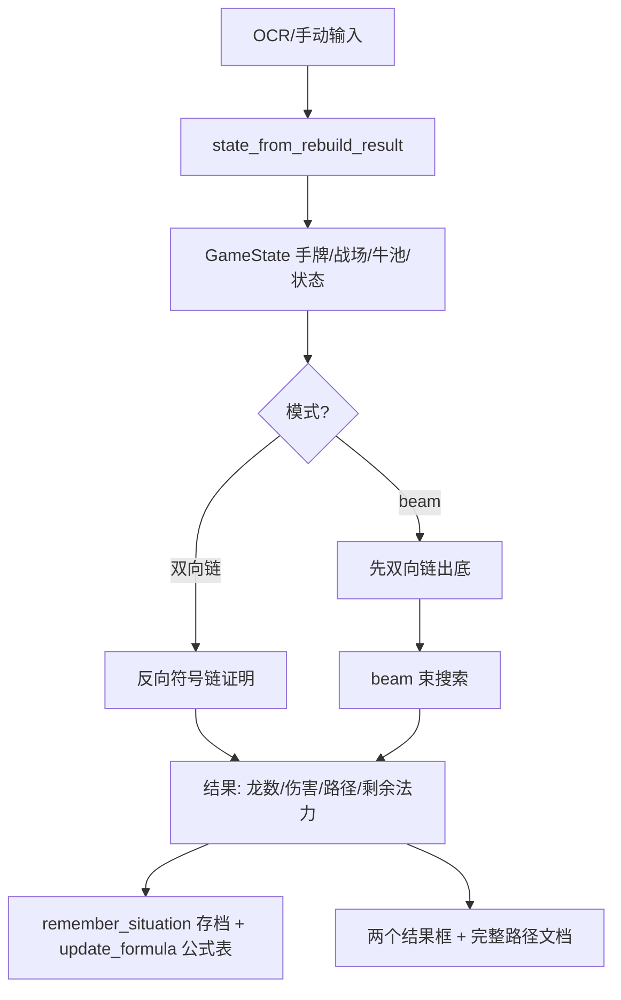

# 红龙贼计算器：双向链与 beam 计算流

> 版本基准：`9ce1915`（战略转移1费、幸运彗星2费）。
> 计算全部由 C++ 核心（`代码/red_dragon_calculator.exe --json`）执行，Python 只做
> 状态构建、JSON 序列化、结果解析与展示；Python 引擎（`beam_search_paths` /
> `enumerate_play_paths`）作为无 exe 时的兜底，规则与 C++ 逐条对齐。

---

## 0. 输入数据（提交数据）

一次计算从这些输入开始：

| 输入 | 来源 | 内容 |
|---|---|---|
| 手牌 | OCR / 手动 | 卡名、当前费用（含锁定 1 费/无固定费用/殒命暗影标记）、血量 |
| 战场 | OCR / 手动 | 随从（只装随从，武器/奥秘不识别） |
| 状态 | OCR / 手动 | 水晶、法力、当前效果（伺机/骨刺/刀油预叠减费）、武器、奥秘、殒命位置 |
| 牛头人剩余卡池 | 勾选 | 牛头人酋长发现池（最多 3 张） |
| 计算参数 | GUI | 龙数上限/下限、链条步数上限、路径上限、束宽、束深/链长、算子深度、模式（beam/双向链） |

数据流起点（GUI `CalculationWorker.run`）：

```text
重建结果 -> state_from_rebuild_result -> GameState（含 etc_band_remaining）
        -> _cpp_search_payload -> JSON payload -> C++ exe（stdin 传入）
        -> 解析 stdout JSON -> CppBeamPath 列表 -> 格式化/存档/展示
```



---

## 1. 双向链：反向符号链证明

### 1.1 准备阶段

1. `state_from_rebuild_result` 生成初始 `GameState`：手牌、战场、水晶/法力、
   牛池（勾选项，缺省 `ETC_BAND`）、殒命暗影标记。
2. 存档查询 `lookup_situation(state)`：键 = 手牌签名 + 战场签名 + 状态签名
   （状态签名**包含牛池**），命中则先展示缓存，后台仍重新计算。
3. 链库 `build_symbolic_chains(target_alex_count)` 按目标龙数取链：
   - 内置模板：鱼狐刀先暗施复制刀油、牛找舞+龙、步杂牌骨架、双舞重铺、
     刀油引擎、6 费鱼先晦中回费双舞重铺等；
   - 每条链附加资源前缀（双币/单币/伺机/骨刺/无资源）与回收尾段
     （暗施复制龙、暗影步回龙、舞动回收、药水复制、牛找、腾武回龙）；
   - 链 = `SymbolicAction` 序列（卡名 + 目标 + 发现选择）。
4. 离散子链库（里程碑骨架，允许中间任意间隔）：用于给候选链排序，先验证
   命中“鱼…龙、龙…晦…龙、双舞、牛(舞,龙)…舞[殒]…”等骨架的链。

### 1.2 反向验证（`validate_symbolic_chain`）

对每个目标龙数（从上限往下搜）：

1. 候选链按「命中离散骨架数」+「链长」排序。
2. 逐动作把链与真实后继比对：
   - 对当前状态跑 `generate_successors`（真实规则：费用、目标、连击、发现、
     腾武单弹、晦回费、药水复制等），看是否有后继的**路径末尾**匹配该动作
     （含目标与发现选择，如 `牛头人酋长（舞动全场->红龙）`）；
   - `chain_action_already_satisfied`：鲨鱼/狐/刀油/伺机/骨刺/晦等“预启动已
     生效”的动作可跳过（不重复打）。
3. 剪枝与复用：
   - `step_memo`（CDCL 式冲突子句）：同一 (初始局面键, 当前局面键, 动作, 剩余法力)
     验证过失败即记 False，后续同局面同动作直接剪掉；
   - 验证成功则缓存后继列表（子链结果复用），后续链直接粘接。
4. 全部动作走完且 `alex_play_count >= 目标龙数` 的状态即“证明通过”。

### 1.3 双向拼接（`bidirectional_symbolic_prove_paths`）

纯反向链搜不到的线，用“前向算子 + 反向尾链”拼接：

1. **前向算子展开**：从初始局面按算子深度 `forward_depth`（默认 5）做
   个位数深度的真实展开（引理交错：优先用已验证的短链），收集可达前沿状态。
2. **反向尾链生成**：从目标龙数反推“尾段”资源需求（手牌/场面/牛池要求、
   是否需殒命），枚举 暗施复制龙 / 步回龙 / 舞回收 / 药水复制 / 牛找 / 腾武回龙
   等尾链，并做代价可行性检查（`tail_mana_feasible`）。
3. **拼接**：前沿状态能同时满足某尾链的手牌/场面/牛池要求 → 拼成完整链；
4. **完整验证**：拼接后的链仍走 1.2 的真实模拟确认，保证可复现。

### 1.4 结果

证明通过的完整路径（动作序列 + 龙数 + 伤害 + 剩余法力）经 `sort_path_states`
排序（伤害 > 龙数 > 路径短 > 法力高）后返回，写入存档与公式表。

---

## 2. beam 束搜索

### 2.1 后继生成（`generate_successors`）

对当前状态枚举所有**合法**动作：

1. 遍历手牌：费用可行、随从栏有空位、奥秘栏有空位、非抽牌法术（抽牌类跳过）；
2. 目标枚举：暗影步/暗施/骨刺/脱水/腾武 可指定友方目标；骨刺/脱水可选击杀分支；
   红龙可选打脸/回血分支；牛头人按鲨鱼双触发枚举发现组合；
3. `play_card_base`：扣费、移出手牌、消耗减费层、记账（路径项）；
4. `apply_search_effect`：执行效果（币回费、伺机/狐减费、刀油叠减费层、
   腾武回手锁 1 费、晦回费、药水复制、战略转移全回收、彗星补连击随从等），
   每个动作可能产生多个后继状态。

### 2.2 评分

每个后继状态的总分：

```text
total = 已打出伤害
      + 子链评分 subchain_score   （鱼龙/龙晦龙/龙暗龙/龙舞龙/龙步龙/腾龙/转龙/牛转/腾刀/双舞/刀刀引擎）
      + 离散路径分 discrete_path_score（路径里程碑：鱼…龙、龙…晦…龙、腾…龙、转…龙、牛…转…）
```

另有**覆盖度 `subchain_coverage`**（局面中已凑齐的子链种类数），作为
“冠军”判据：结构最完整的深线优先保留。

### 2.3 束宽剪枝

每层：

1. 后继去重（状态键含手牌/战场/减费/牛池/连击状态），保留法力更高的替身；
2. **按当前龙数分桶**（避免高龙数分支挤掉正在蓄力的低龙数高分分支）；
3. 桶内按 `total` 降序 + 法力降序取前 `per_bucket`，另加一个
   “覆盖度冠军”兜底；
4. 合并后截断到 `beam_width`（默认 3000）。

深度上限 = beam 束深（默认 25/30，可调），路径上限截断返回条数。

### 2.4 结果

每龙数保留“总分最高”的终局路径，按伤害/龙数排序后输出；
`beam 比双向链更好时记录到 logs/beam_improvements.json`（附场面数据）。

---

## 3. 两路共用链路

1. **payload**：`_cpp_search_payload` 序列化（水晶/法力/手牌含 temp_cost·locked·
   quickdraw·deadly/战场/奥秘/武器/牛池/龙数上下限/束宽/束深/模式/算子深度）；
2. **执行**：`_run_cpp_search` 起 `red_dragon_calculator.exe --json`，stdin 传
   JSON，实时回调（进度/已发现龙数），支持中止；
3. **解析**：C++ 返回 `results[]`（龙数/伤害/剩余法力/路径），转 `CppBeamPath`；
4. **落盘**：`remember_situation`（局面存档，含牛池键）、`update_formula`
   （公式表：手牌/随从栏/水晶/法力键）；
5. **展示**：完整路径文档 + “双向链计算最高伤害路径”框 + “beam束状计算最高
   伤害路径”框（beam 模式下先双向链瞬间出底，再 beam 覆盖）。

---

## 4. 关键差异

| 维度 | 双向链 | beam |
|---|---|---|
| 思路 | 先想结构（链库/引理），再逐链真实验证 | 直接枚举真实后继，按子链评分留优 |
| 覆盖范围 | 依赖链库模板（漏线则搜不到） | 不依赖模板，但受束宽/深度限制 |
| 速度 | 亚秒级（链库直接命中） | 秒~十秒级（束宽 3000） |
| 正确性保证 | 每条链都经真实模拟确认 | 每条路径都是真实状态序列 |
| 定位 | 快速出底 + 证明 | 深挖未知线路（实验验算） |
